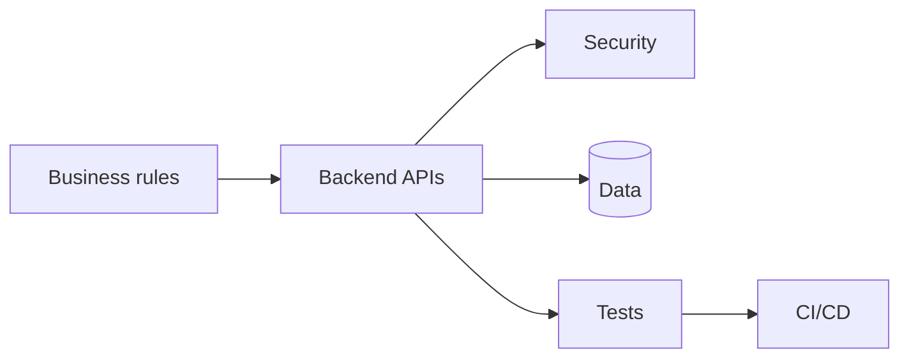

**English** | [Português](README.pt-BR.md)

# Samuel Henrique Farias Dias

**Backend Developer focused on secure APIs, business rules and maintainable software.**

## About me

I work as a Software Developer at **Inovaskill / Equipe Helda Cervejaria** and study **Technology in Intelligent Systems** at FATEC Shunji Nishimura, with graduation expected in June 2028.

My accounting technician background, Commercial Management studies and experience as President and Finance Director at InterGestão Jr. help me connect technical decisions with business processes, controls and goals.

## Technical skills

| Area | Technologies and practices |
| --- | --- |
| Primary backend | Node.js, TypeScript, NestJS and Express |
| JVM ecosystem | Kotlin and Spring Boot |
| APIs and security | REST, JWT, RBAC, validation, rate limiting and Swagger/OpenAPI |
| Data | MySQL, MariaDB, SQLite, Prisma, TypeORM and Flyway |
| Quality and delivery | Vitest, Jest, JUnit, MockK, Docker, GitHub Actions and Git |
| Additional experience | Angular, JavaScript, Python, Linux and TCP/IP |
| Languages | Portuguese (native) and English (intermediate, technical reading) |

## Featured projects

| Project | Technical highlights |
| --- | --- |
| [RodoJacto Management Platform](https://github.com/samuelhfdias-prog/Teste-Rodojacto) | Kotlin, Spring Boot, Spring Security, JWT, Flyway, MySQL, Docker, OpenAPI and automated tests |
| [Momesso Fleet Control](https://github.com/samuelhfdias-prog/Teste-momesso) | NestJS, Angular, multitenancy, RBAC, TypeORM, SQLite, rate limiting, tests and CI |
| [RAG Demo with Claude](https://github.com/samuelhfdias-prog/rag-demo-claude) | TypeScript, Express, SQLite, RAG, local embeddings, API-key authentication and Claude integration |
| [Projeto Saber Cuidar](https://github.com/samuelhfdias-prog/Projeto_saber_cuidar) | Node.js, TypeScript, Prisma, authentication and REST APIs documented with Swagger/OpenAPI |

## Education and leadership

- **Technology in Intelligent Systems** - FATEC Shunji Nishimura, in progress, expected June 2028
- **Accounting Technician** - ETEC Pompeia, completed December 2019
- **Commercial Management studies** - FATEC Assis, through 2024
- **President and Finance Director** - InterGestão Jr., March 2020 to December 2021

## Current focus

- Deepening backend engineering with Node.js, TypeScript and NestJS
- Building reliable APIs with automated tests, CI/CD and clear documentation
- Strengthening database, cloud and software architecture skills
- Preparing for international collaboration in English

## Contact

[LinkedIn](https://www.linkedin.com/in/samuel-dias-13aa08168/)
