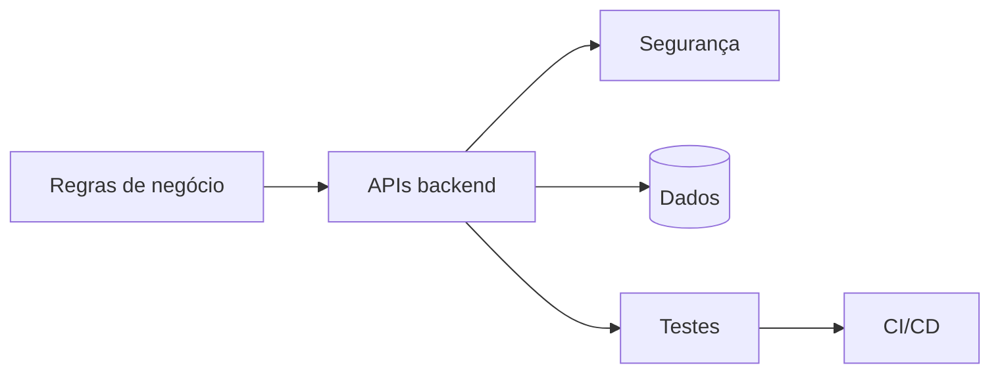

[English](README.md) | **Português**

# Samuel Henrique Farias Dias

**Desenvolvedor Backend focado em APIs seguras, regras de negócio e software sustentável.**

## Sobre mim

Atuo como Desenvolvedor de Software na **Inovaskill / Equipe Helda Cervejaria** e curso **Tecnologia em Sistemas Inteligentes** na FATEC Shunji Nishimura, com conclusão prevista para junho de 2028.

Minha formação técnica em Contabilidade, os estudos em Gestão Comercial e a experiência como Presidente e Diretor Financeiro da InterGestão Jr. me ajudam a conectar decisões técnicas aos processos, controles e objetivos do negócio.

## Competências técnicas

| Área | Tecnologias e práticas |
| --- | --- |
| Backend principal | Node.js, TypeScript, NestJS e Express |
| Ecossistema JVM | Kotlin e Spring Boot |
| APIs e segurança | REST, JWT, RBAC, validação, rate limiting e Swagger/OpenAPI |
| Dados | MySQL, MariaDB, SQLite, Prisma, TypeORM e Flyway |
| Qualidade e entrega | Vitest, Jest, JUnit, MockK, Docker, GitHub Actions e Git |
| Experiência adicional | Angular, JavaScript, Python, Linux e TCP/IP |
| Idiomas | Português nativo e inglês intermediário com leitura técnica |

## Projetos em destaque

| Projeto | Destaques técnicos |
| --- | --- |
| [RodoJacto Management Platform](https://github.com/samuelhfdias-prog/Teste-Rodojacto) | Kotlin, Spring Boot, Spring Security, JWT, Flyway, MySQL, Docker, OpenAPI e testes automatizados |
| [Momesso Fleet Control](https://github.com/samuelhfdias-prog/Teste-momesso) | NestJS, Angular, multitenancy, RBAC, TypeORM, SQLite, rate limiting, testes e CI |
| [RAG Demo with Claude](https://github.com/samuelhfdias-prog/rag-demo-claude) | TypeScript, Express, SQLite, RAG, embeddings locais, autenticação por chave de API e integração com Claude |
| [Projeto Saber Cuidar](https://github.com/samuelhfdias-prog/Projeto_saber_cuidar) | Node.js, TypeScript, Prisma, autenticação e APIs REST documentadas com Swagger/OpenAPI |

## Formação e liderança

- **Tecnologia em Sistemas Inteligentes** - FATEC Shunji Nishimura, em andamento, conclusão prevista para junho de 2028
- **Técnico em Contabilidade** - ETEC Pompeia, concluído em dezembro de 2019
- **Estudos em Gestão Comercial** - FATEC Assis, até 2024
- **Presidente e Diretor Financeiro** - InterGestão Jr., de março de 2020 a dezembro de 2021

## Foco atual

- Aprofundar o desenvolvimento backend com Node.js, TypeScript e NestJS
- Construir APIs confiáveis com testes automatizados, CI/CD e documentação clara
- Fortalecer conhecimentos em bancos de dados, cloud e arquitetura de software
- Preparar-me para colaboração internacional em inglês

## Contato

[LinkedIn](https://www.linkedin.com/in/samuel-dias-13aa08168/)
